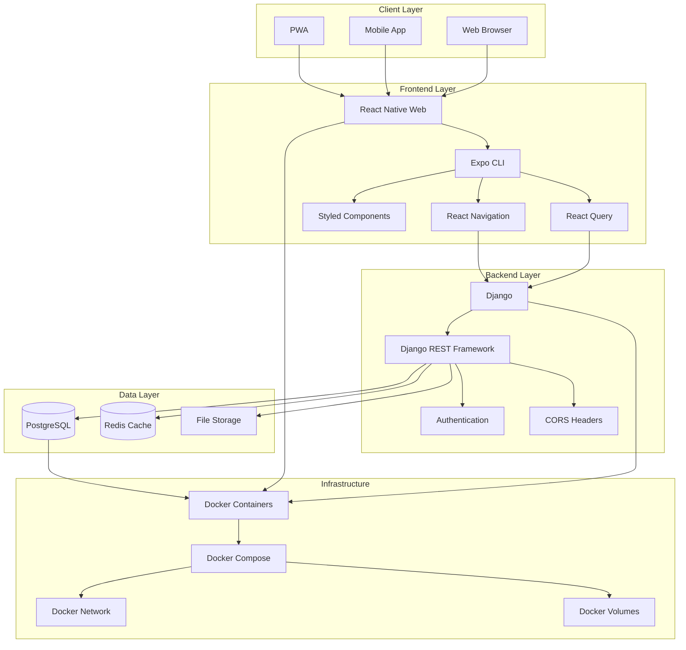

# 🏗️ Foundation PWA Architecture

## System Overview



## Component Details

### 🎨 Frontend Architecture

```
┌─────────────────────────────────────────────────────────────┐
│                    React Native Web                         │
├─────────────────────────────────────────────────────────────┤
│                                                             │
│  ┌─────────────┐  ┌─────────────┐  ┌─────────────┐        │
│  │   Screens   │  │ Components  │  │   Services  │        │
│  │             │  │             │  │             │        │
│  │ • Home      │  │ • Header    │  │ • API Calls │        │
│  │ • About     │  │ • Footer    │  │ • Auth      │        │
│  │ • Contact   │  │ • Forms     │  │ • Storage   │        │
│  │ • Donate    │  │ • Cards     │  │             │        │
│  └─────────────┘  └─────────────┘  └─────────────┘        │
│           │               │               │                │
│           └───────────────┼───────────────┘                │
│                           │                                │
│  ┌─────────────────────────────────────────────────────────┐ │
│  │                 Navigation Layer                        │ │
│  │                                                         │ │
│  │ • Stack Navigator                                       │ │
│  │ • Tab Navigator                                         │ │
│  │ • Drawer Navigator                                      │ │
│  └─────────────────────────────────────────────────────────┘ │
│                           │                                │
│  ┌─────────────────────────────────────────────────────────┐ │
│  │                 State Management                        │ │
│  │                                                         │ │
│  │ • React Query (Server State)                            │ │
│  │ • React Context (Local State)                           │ │
│  │ • Async Storage (Persistent)                            │ │
│  └─────────────────────────────────────────────────────────┘ │
└─────────────────────────────────────────────────────────────┘
```

### 🔧 Backend Architecture

```
┌─────────────────────────────────────────────────────────────┐
│                      Django Backend                        │
├─────────────────────────────────────────────────────────────┤
│                                                             │
│  ┌─────────────┐  ┌─────────────┐  ┌─────────────┐        │
│  │    Apps     │  │   Settings  │  │   URLs      │        │
│  │             │  │             │  │             │        │
│  │ • Core      │  │ • Database  │  │ • API URLs  │        │
│  │ • Users     │  │ • Security  │  │ • Admin     │        │
│  │ • Donations │  │ • CORS      │  │ • Static    │        │
│  │ • Products  │  │ • JWT       │  │             │        │
│  └─────────────┘  └─────────────┘  └─────────────┘        │
│           │               │               │                │
│           └───────────────┼───────────────┘                │
│                           │                                │
│  ┌─────────────────────────────────────────────────────────┐ │
│  │                 REST API Layer                          │ │
│  │                                                         │ │
│  │ • Serializers                                           │ │
│  │ • ViewSets                                              │ │
│  │ • Permissions                                           │ │
│  │ • Authentication                                        │ │
│  └─────────────────────────────────────────────────────────┘ │
│                           │                                │
│  ┌─────────────────────────────────────────────────────────┐ │
│  │                 Database Layer                          │ │
│  │                                                         │ │
│  │ • Models                                                │ │
│  │ • Migrations                                            │ │
│  │ • Relationships                                         │ │
│  │ • Queries                                               │ │
│  └─────────────────────────────────────────────────────────┘ │
└─────────────────────────────────────────────────────────────┘
```

### 🐳 Docker Architecture

```
┌─────────────────────────────────────────────────────────────┐
│                    Docker Compose                          │
├─────────────────────────────────────────────────────────────┤
│                                                             │
│  ┌─────────────────┐    ┌─────────────────┐                │
│  │   Frontend      │    │    Backend      │                │
│  │   Container     │    │   Container     │                │
│  │                 │    │                 │                │
│  │ • Node.js 18    │    │ • Python 3.11   │                │
│  │ • Expo CLI      │    │ • Django 4.2    │                │
│  │ • Port 3000     │    │ • Port 8000     │                │
│  │ • Hot Reload    │    │ • Auto Reload   │                │
│  └─────────────────┘    └─────────────────┘                │
│           │                       │                        │
│           └───────────────────────┼────────────────────────┘
│                                   │                         │
│  ┌─────────────────────────────────┼─────────────────────────┐ │
│  │           Database              │                         │ │
│  │         Container               │                         │ │
│  │                                 │                         │ │
│  │ • PostgreSQL 15                 │                         │ │
│  │ • Port 5432                     │                         │ │
│  │ • Persistent Volume             │                         │ │
│  └─────────────────────────────────┴─────────────────────────┘ │
│                                                             │
│  ┌─────────────────────────────────────────────────────────┐ │
│  │                 Shared Resources                        │ │
│  │                                                         │ │
│  │ • Network: foundation_network                           │ │
│  │ • Volumes: postgres_data, static_volume, media_volume   │ │
│  │ • Environment Variables                                 │ │
│  └─────────────────────────────────────────────────────────┘ │
└─────────────────────────────────────────────────────────────┘
```

## Data Flow

### 1. User Request Flow
```
User → Frontend → API → Backend → Database → Response
```

### 2. Authentication Flow
```
Login → JWT Token → API Calls → Token Validation → Protected Resources
```

### 3. Data Fetching Flow
```
Component → React Query → API Service → Django View → Database → Serialized Data
```

## Security Considerations

### Frontend Security
- HTTPS in production
- Input validation
- XSS prevention
- Secure storage of tokens

### Backend Security
- CORS configuration
- JWT token validation
- SQL injection prevention
- CSRF protection
- Rate limiting

### Infrastructure Security
- Container isolation
- Network segmentation
- Environment variable protection
- Volume encryption

## Performance Optimizations

### Frontend
- React Query caching
- Lazy loading
- Code splitting
- Image optimization

### Backend
- Database indexing
- Query optimization
- Caching strategies
- Pagination

### Infrastructure
- Container resource limits
- Load balancing
- CDN for static files
- Database connection pooling

## Monitoring & Logging

### Frontend Monitoring
- Error tracking
- Performance metrics
- User analytics
- Crash reporting

### Backend Monitoring
- Request logging
- Error tracking
- Database performance
- API metrics

### Infrastructure Monitoring
- Container health
- Resource usage
- Network traffic
- Volume usage 